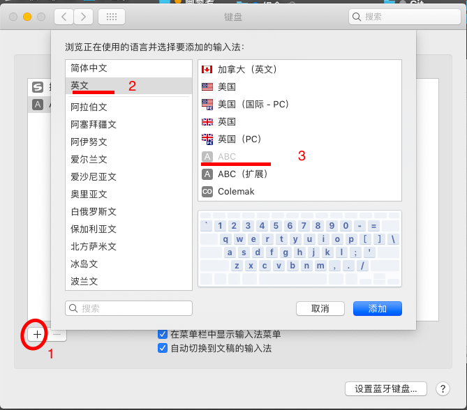

# 我的vim配置

仿sublime的快捷键，绝大多数时间可在insert模式下工作

安装各种实用插件，fork了一些插件，改善了corner cases下的用户体验

实现了一些insert模式下基础操作，相比原生的vim命令，同样改善了corner cases下的用户体验

## 安装方法

本配置支持neovim，vim>=8.0，vim-gnome，macvim，

`vim --version` 查看特性，需要支持(显示`+`号)以下特性：clipboard、python 或 python3、conceal

这里只展示neovim的安装方法；其他的vim安装很方便，可请自行安装。

### n(eo)vim安装方法

- mac：`brew install neovim`，而后在命令行中输入`nvim`即可使用此镜像

  `whereis neovim`可查看其二进制文件所在路径

- linux：从[官网](https://github.com/neovim/neovim/releases/tag/v0.3.4)下载最新的镜像文件`nvim.appimage`

  使用方法：

  - 系统有FUSE

    设置为可执行文件`chmod u+x nvim.appimage`

    直接`./nvim.appimage`，即启动nvim，相当于输入`vim`命令

    

    修改PATH以便使用：

    ```bash
    mv nvim.appimage 【某个你用的路径，如/local】/bin/nvim
    ```

    在.zshenv之类的文件中加入

    ```bash
    export PATH=【某个你用的路径，如/local】/bin:$PATH
    ```

    而后在命令行中输入`nvim`即可使用此镜像

  - 系统无FUSE，将镜像解压，执行其中的二进制文件

    ```
    ./nvim.appimage --appimage-extract # 解压得到 squashfs-root/ 文件夹
    ./squashfs-root/usr/bin/nvim
    ```

    ​	

    修改PATH以便使用：将`squashfs-root/`放到任何你要的【地方】，再在.zshenv之类的文件中加入

    ```
    export PATH=【地方】/squashfs-root/usr/bin/:$PATH
    ```

    而后在命令行中输入`nvim`即可使用此镜像

* 设置nvim配置文件的链接

  ```bash
  ln -s 《本repo》/{.vim,.vimrc,.vimrc.bundles} ~
  ln -s ~/.vim ~/.config/nvim
  ```

  注：

  * `~/.config/nvim/init.vim` 相当于 `~/.vimrc` ，可直接用之
  * `~/.config/nvim` 相当于` ~/.vim`，可直接用之
  * `本repo/.vim/init.vim -> ../.vimrc`  的链接已经设过了，您无需`ln -s ~/.vimrc ~/.config/nvim/init.vim`

### 安装neovim的python依赖

安装neovim的python依赖

```bash
pip install neovim
```

UltiSnippets、YouCompleteMe 需要当中至少一个才能使用；但YouCompleteMe的编译无需之

### 安装vim插件

命令行下输入

```
nvim  +'PlugInstall --sync' +'PlugUpdate' +qa  
```

以自动安装Vim-Plug，并安装插件，特别是编译YouCompleteMe插件

### 加载iterm2的profile

[图文教程](https://www.jianshu.com/p/c251d26374c5)

```
cp vim_keymap.json ~/Library/Application\ Support/iTerm2/DynamicProfiles/
```

在iterm2 （不用重启，动态加载），`⌘,`设置，中选择vim_keymap 这个profile

注：GUID是profile的唯一id。vim_keymap.json中的GUID参数不可与你已有profile的GUID相同，不然vim_keymap不会加载。

### 修改mac的英文键盘方案

这一设置并不需要。这里只是想说明，我的alt+字母是采用的哪套方案，以便你自行添加其他快捷键。所有.vimrc里用到的alt+字母都已经在上述profile里设置过了。

### 


## 使用快捷键

详见`~/.vimrc`中的注释

## 内核选用neovim

neovim（简称nvim）是vim的一个fork项目，重构了其内核。

### 选择nvim的原因

* 我的vim配置依赖以下vim的特性
  * clipboard：系统剪切板与vim剪切板互通
  * python 或 python3：UltiSnippets、YouCompleteMe 需要当中至少一个
  * ​conceal：无此特性，则indentline无法显示缩进线, NERDTree的树栏中会出现`^G`符号作为一个文件(夹)的前缀

  查看vim是否支持上述特性，请执行`vim --version`，返回列表中，加号表示支持，减号表示不支持。

  vim不一定都支持，但nvim支持上述所有特性。

* nvim比vim在翻页时更快，特别是用鼠标滚动翻页时，nvim能够实时停下，而vim会持续滚动很久才停

### 快捷键设置注意事项

neovim在设置快捷键时和vim不同，请见下[neovim的escape sequence无法识别](#neovim的escape sequence无法识别)

## 快捷键设置

为了能够利用尽可能多的快捷键，需要用iterm2的按键映射功能

### 为什么要用iterm2

因为若不用，会浪费很多组合按键

* linux系统中，以下按键是等价的

```
enter=ctrl+m
tab=ctrl+i   (但ctrl+tab ≠ ctrl+i)
delete=ctrl+d
esc=ctrl+[
shift+ctrl+字母=ctrl+字母
...
```

- 普通终端发送不了一些按键，如fn+ctrl+方向

  把上述重复的组合按键，用iterm2的按键映射功能，转成一个冷门文字，再在~/.vimrc中将此文字映射成你要的按键，详见下[neovim的escape sequence无法识别](#neovim的escape sequence无法识别)/冷门文字

  注：iterm2不是所有`shfit+ctrl+字母`都支持设置键盘映射，例如"shift+ctrl+t"就无法设置

### neovim的escape sequence无法识别

escqpe sequence是以escape键开头的一串按键，例如\<esc>d，只要你先按\<esc>后按a，间隔足够短，就能被vim当成是一个escqpe sequence，进行整体理解，而非分开理解。

在neovim使用escqpe sequence有以下要注意的：

* 时间限制

  （vim中无需如下设置，但设置了不影响vim使用）

   `.tmux.config`中设

  ```bash
  # 避免让nvim把一串escape sequence识别断
  aset -g escape-time 10
  # Or for tmux >= 2.6
  # set -sg escape-time 10
  ```

  `~/.vimrc`中设

  ```
  set timeout           " mapping的时长限制
  set timeoutlen=1000   " 单位毫秒，默认值1000
  set ttimeout          " 收到键码串的时长限制，例如escape sequance
  set ttimeoutlen=50    " 察觉不到的小值，键码串必需50ms内收到，不然当断开处理
  ```

  如此可使从tmux发出的按键序列比10ms短，比50ms短，故而能被vim识别成一组按键序列，执行器对应的功能，而不是将此序列断开来处理

* escape和alt-键

  neovim中，\<esc>+一个键，应该写作\<M-一个键>(alt+这个键)，而这种写法vim不支持。故应该写成下面这样 

  ```
  if has('nvim')
      nmap <M-d>  <plug>DeleteWordAfter
  else
  	nmap <esc>d <plug>DeleteWordAfter
  endif
  ```

* 其他escape sequence 不支持

  neovim对\<esc>后长度超过1的escape sequence支持不太好，很多都识别不了；而vim无此问题。例如

  ```
  # 在cat -v下输入 Fn+ctrl+left(即Ctrl+Home），返回^[[1;5F
  nmap <esc>[1;5F <plug>SomeFunction
  ```

  这个escape sequence，nvim会理解成``<esc>` `[1;5F`。为解决此问题，可采用iterm2，将这些 Fn+ctrl+left之类的按键（只要在vim之外用不到的），都映射成冷文文字即可。

* 冷门文字

  iterm中，选`profile`-`key`-`+`-输入组合快捷键-选`Send Key`-输入一个冷门文字（如 ‘\xE1\x9C\x80’=‘ᜀ’ ，\xE1\x9C\xA0='ᜠ'附近的字符 ），可参考[utf-8编码查询](http://bianma.911cha.com)。

  然后在~/.vimrc中写这样的映射

  ```
  nnoremap ᜀ  do_some_thing
  ```

  注意，不要选择输入该冷门文字的`Hex Code`，不然在tmux下开(n)vim，(n)vim会理解成一个一个字节断开的字符。

## 插件管理器

用Vim-Plug，不要用vundle，原因如下表

| 特性                       | Vim-Plug | Vundle |
| -------------------------- | -------- | ------ |
| 并行加载插件，启动vim快    | 是       | 否     |
| 使用插件的命令时才加载插件 | 支持     | 不支持 |
| 并行安装、更新插件         | 支持     | 不支持 |
| 编译插件                   | 支持     | 不支持 |

### .vimrc插件写法

```
" 自动安装vim-plug 到 ~/.vim/autoload/plug.vim   (vim用)
"                 到 ~/.local/share/nvim/site/autoload   (neovim用)
if empty(glob('~/.vim/autoload/plug.vim'))
  silent !curl -fLo ~/.vim/autoload/plug.vim --create-dirs
    \ https://raw.githubusercontent.com/junegunn/vim-plug/master/plug.vim
  autocmd VimEnter * PlugInstall --sync | source $MYVIMRC
endif

if &compatible
  set nocompatible
end

call plug#begin('~/.vim/plugged')

" ------Plugins start------- 
" <github号>/<repo名>
Plug 'junegunn/vim-easy-align'     
" repo的url
Plug 'https://github.com/junegunn/vim-github-dashboard.git'
" 本地绝对路径
Plug '~/my-prototype-plugin'

" 装两个插件(相当于分两行写)，|是或的意思，前一个执行失败不影响后一个执行
Plug 'SirVer/ultisnips' | Plug 'honza/vim-snippets'

" { 'on': "触发条件" }，在normal模式下，写作":NERDTreeToggle<cr>"
Plug 'scrooloose/nerdtree', { 'on':  'NERDTreeToggle' }
" { 'for': '<文件的语言>' }
Plug 'tpope/vim-fireplace', { 'for': 'clojure' }
" { 'branch': '<repo的分支名>' }
Plug 'rdnetto/YCM-Generator', { 'branch': 'stable' }
" 指定插件repo所用git标签，rtp描述了包含vim插件的子目录；
Plug 'nsf/gocode', { 'tag': 'v.20150303', 'rtp': 'vim' }
" 安装插件时，在终端下，cd到'dir'目录，执行'do'命令，多用于插件的编译
Plug 'junegunn/fzf', { 'dir': '~/.fzf', 'do': './install --all' }
" ------Plugins end  -------

if filereadable(expand("~/.vimrc.bundles.local"))
    source ~/.vimrc.bundles.local
endif
call plug#end()
```

[更多详见](https://vim.ink/vim-plug.html)

注意：

* `Plug '插件路径', { '参数名': '参数' }`，在`,` 后必须有至少一个空格，不然无法识别参数，就当成没有参数

* 一个参数名，有多个参数写成如下列表格式 ：

  ```
  Plug 'scrooloose/nerdtree', { 'on': ['NERDTreeToggle','NERDTreeMirror','NERDTree'] }
  ```

### 在(v)vim中安装

`:PlugInstall` : 安装插件

`:PlugUpdate` : 更新插件

`:PlugDiff` : 安装或更新后，查看插件有啥变化

`:PlugClean`: 检测并删除失效插件

### 在命令行下安装

以下安装方法无需中途输入任何按键，但屏幕会显示安装教程

* (n)vim写法：`(n)vim  +'PlugInstall --sync' +'PlugUpdate' +qa`  并行安装

* 这不同于Vundle的写法：` vim +PlugInstall +qall` 串行安装

## YouCompleteMe插件

vim的自动补全插件，会实时显示候选菜单，需要编译，是所有vim插件中最为折腾的

[参考教程](https://www.jianshu.com/p/edc4bbed92ca)

### 编译

#### 依赖

* mac

  ```
  brew install cmake
  ```

* linux

  ```bash
  sudo apt-get install cmake
  sudo apt-get install build-essential
  sudo apt-get install python python-dev
  apt-get install llvm-3.9 clang-3.9 libclang-3.9-dev libboost-all-dev # 如果不需要 C 家族的语义化补全，则可跳过这一步
  ./install.py
  ```

#### 自动编译

在 `/.vimrc`文件中加入

```
Plug 'Valloric/YouCompleteMe', {'do':'python3 install.py'}
```

然后同其他插件一同，在命令行中执行`(n)vim  +'PlugInstall --sync' +'PlugUpdate' +qa`  并行下载、安装与编译

**带特定语言补全的支持**

上文改为

C-family languages

```
Plug 'Valloric/YouCompleteMe',{'do':'python3 install.py --clang-completer'}
```

C# suppor t`brew install Mono`

```
Plug 'Valloric/YouCompleteMe',{'do':'python3 install.py --cs-completer'}
```

Go support

```
Plug 'Valloric/YouCompleteMe',{'do':'python3 install.py --go-completer'}
```

Rust support: support `brew install rust`

```
Plug 'Valloric/YouCompleteMe',{'do':'python3 install.py --rust-completer'}
```

Java support: support  `brew cask install java8`

```
Plug 'Valloric/YouCompleteMe',{'do':'python3 install.py --java-completer'}
```

全部安装

```
Plug 'Valloric/YouCompleteMe',{'do':'python3 install.py --all'}
```

#### 手动编译

若自动下载安装成功、但自动编译失败，则需手动编译：`~/.vim/plugged/YouCompleteMe`，执行

```
./install.py
```

可能的编译不成功的原因：

* `(n)vim --version`，若返回显示 python 和 python3 都不支持（是`-`号），则会无法编译
* 上文所述编译依赖没装全，或者太老了，请找管理员安装或升级

#插件推荐列表

我想装还装的插件有：

[利器系列之 —— 编辑利器 Vim 之插件配置](http://blog.guorongfei.com/2015/10/06/vim-plugin/)

[如何优雅的使用 Vim（二）：插件介绍](https://segmentfault.com/a/1190000014560645)

[那些离了就活不了的 VIM 插件](https://www.zlovezl.cn/articles/vim-plugins-cannot-live-without/)

[mac下配置vim](https://www.jianshu.com/p/923aec861af3)

* python代码缩进：`Plug 'vim-scripts/indentpython.vim'`

* python代码自动转pep8格式：`Plug 'tell-k/vim-autopep8'`

* 代码折叠：`Plug 'tmhedberg/SimpylFold'`

  都提供对方法（methods）或类（classes）进行折叠的手段，只显示类或方法的定义部分，而不是全部的代码。

* 标签窗口：`Plug 'vim-scripts/taglist.vim'`

  显示定位程序中各种符号的插件（例如宏定义、变量名、结构名、函数名）

# 文档

[vim中文帮助下载](https://github.com/yianwillis/vimcdoc/releases)

[vim中文帮助在线](http://yianwillis.github.io/vimcdoc/)